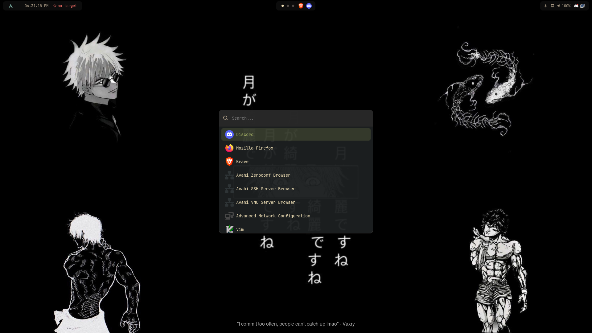

# dotfiles

Mi configuración de Arch Linux modificada de mi amigo lexo pasada a lua — Hyprland, Waybar, Fish, Kitty y más.



## Instalación

```bash
git clone https://github.com/JAVIKRD/dotfiles.git
cd dotfiles
bash install.sh
```

El script revisa dependencias, avisa qué falta, y copia las configuraciones a `~/.config` (haciendo backup de lo que ya tengas).

## Incluye

- Hyprland
- Waybar
- Kitty
- Fish shell
- Tmux
- Wofi
- Dunst
- Rofi
- Starship prompt

## Atajos de teclado

### Apps
| Atajo | Acción |
|---|---|
| `SUPER + Return` | Abrir terminal (kitty) |
| `SUPER + D` | Launcher (wofi) |
| `SUPER + B` | Abrir Firefox |
| `SUPER + E` | Abrir explorador de archivos (thunar) |
| `SUPER + SHIFT + Return` | Abrir VS Code |

### Ventanas
| Atajo | Acción |
|---|---|
| `SUPER + Q` | Cerrar ventana |
| `SUPER + SHIFT + E` | Salir de Hyprland |
| `SUPER + F` / `SUPER + SHIFT + F` | Pantalla completa |
| `SUPER + Space` | Modo flotante |
| `SUPER + P` | Modo pseudo |
| `SUPER + J` | Alternar split |
| `SUPER + Tab` | Ciclar entre ventanas |

### Foco y movimiento (vim-style)
| Atajo | Acción |
|---|---|
| `SUPER + H/J/K/L` | Mover foco (izq/abajo/arriba/der) |
| `SUPER + SHIFT + H/J/K/L` | Mover ventana |
| `SUPER + CTRL + H/J/K/L` | Redimensionar ventana |

### Workspaces
| Atajo | Acción |
|---|---|
| `SUPER + 1` | Ir al workspace 1 |
| `SUPER + 2` | Ir al workspace 2 |
| `SUPER + 3` | Ir al workspace 3 |
| `SUPER + 4` | Ir al workspace 4 |
| `SUPER + 5` | Ir al workspace 5 |
| `SUPER + 6` | Ir al workspace 6 |
| `SUPER + 7` | Ir al workspace 7 |
| `SUPER + 8` | Ir al workspace 8 |
| `SUPER + 9` | Ir al workspace 9 |
| `SUPER + 0` | Ir al workspace 10 |

### Capturas y portapapeles
| Atajo | Acción |
|---|---|
| `Print` | Copiar captura de área |
| `SHIFT + Print` | Copiar captura de pantalla completa |
| `SUPER + Print` / `CTRL + ALT + S` | Capturar área y guardar en `~/Pictures/Screenshots` |
| `SUPER + V` | Historial del portapapeles (cliphist) |

### Sistema
| Atajo | Acción |
|---|---|
| `SUPER + M` | Bloquear pantalla |
| `SUPER + N` | Cerrar todas las notificaciones |
| `SUPER + SHIFT + N` | Reabrir última notificación |
| `SUPER + F1` | Ver cheatsheet de atajos |
| `SUPER + W` | Menú de red |

### Multimedia (teclas especiales)
| Atajo | Acción |
|---|---|
| `Volumen +/-` | Subir/bajar volumen |
| `Mute` | Silenciar audio |
| `Mic Mute` | Silenciar micrófono |
| `Brillo +/-` | Subir/bajar brillo |
| `Play/Pausa`, `Next`, `Prev` | Control de reproducción multimedia |
